**[Labs Home](../README.md)**
# Aurora RDS Hands on Lab

## **Overview**

Amazon Aurora is a MySQL and PostgreSQL-compatible relational database built for the cloud, that combines the performance and availability of traditional enterprise databases with the simplicity and cost-effectiveness of open source databases.

Amazon Aurora is up to five times faster than standard MySQL databases and three times faster than standard PostgreSQL databases. It provides the security, availability, and reliability of commercial databases at 1/10th the cost. Amazon Aurora is fully managed by Amazon Relational Database Service (RDS), which automates time-consuming administration tasks like hardware provisioning, database setup, patching, and backups.

The purpose of this lab is to help the user become familiar with basic features of Aurora such as creating an Aurora MYSQL database, loading data, creating read replica and cloning the database.  In addition, this lab covers operational features such as creating snapshots and subscribing to failover notifications.

## **Creating an Amazon Aurora Database Cluster**

An Amazon Aurora DB cluster consists of a DB instance, compatible with either MySQL or PostgreSQL, and a cluster volume that represents the data for the DB cluster, copied across three Availability Zones as a single, virtual volume. The DB cluster contains a primary instance and, optionally, up to 15 Aurora Replicas.

In this section, we will create a simple Aurora DB cluster with a primary node and a standby node.

### **Create an Aurora DB cluster using the AWS Management Console**

Sign in to the AWS Management Console and open the **[Amazon RDS console](https://ap-southeast-2.console.aws.amazon.com/rds/home?region=ap-southeast-2**)

Choose **Create database** to start the Create database wizard. The wizard opens on the **Select engine** page.

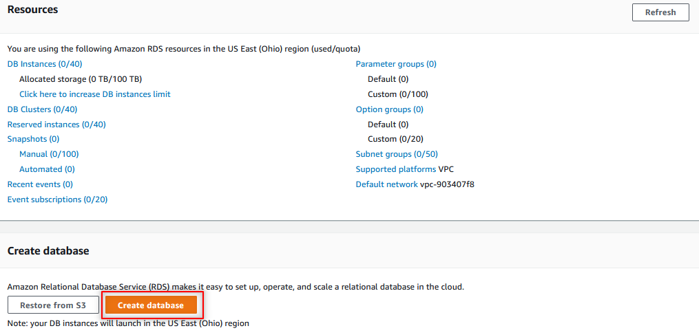

On the **Choose a database creation method** section select the **Standard Create** Option

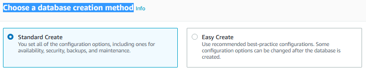

In the **Engine Options** section select **Amazon Aurora**, with **MySQL** compatibility mode and **Aurora-MySQL** **version 5.7.12**

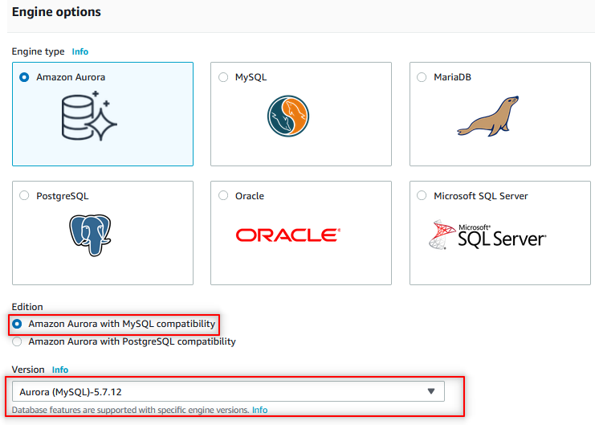

In the next step select the **Production** template

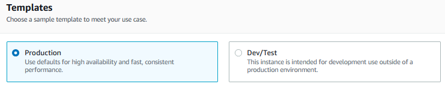

Specify database cluster settings:
* DB cluster identifier: **aurora-[yourname]**
* Master username: **root**
* Master password: **Password123!**

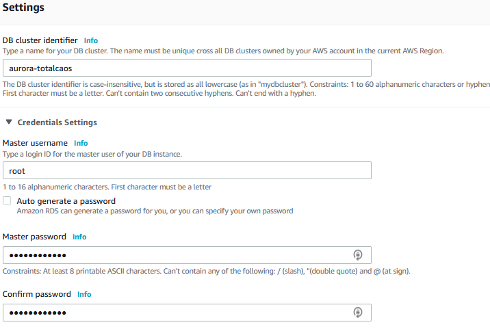

Specify DB Instance Size settings
* DB Instance Class: (Burstable) / **db.t2.small**

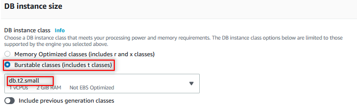

Create a replica/reader for the db cluster

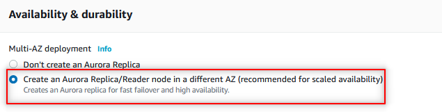

Configure Connectivity Settings

* VPC: Use the default VPC
* Subnet Group: Use the default subnet group
* Publicly accessible: For the purposes of the lab, select yes
* VPC Security Group: Select the create new option
* VPC Group Name: GID-aurora-db-SG
* Database Port: leave as default 3306

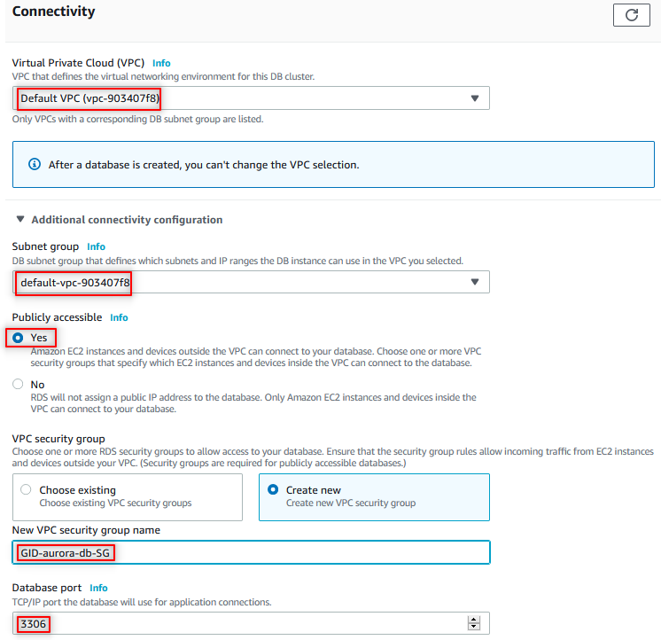

_**Note**: We are making the db publicly accessible only for the purposes of this lab.  This is **not recommended** for most workloads production or development._

Under the Additional Configuration section, disable termination protection

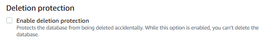

Click the create button to create and launch the RDS instance.

When your database instance status changes to available.  Select primary database aurora-{yourname}-instance-1 database by clicking on the link

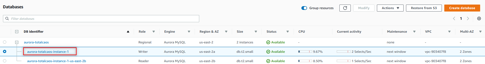

Under the **Connectivity & Security** section and note down your Endpoint.  This endpoint is needed in later sections of the lab.

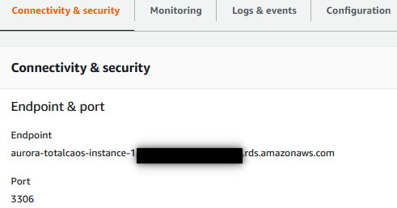

Up to this point, you have created a new Aurora MYSQL cluster with a primary and standby node.  The standby node aurora-{yourname}-instance1-{region-az} is the standby node that is used if the primary database goes down.  In the next section, we will access the primary Aurora node.

### **Accessing your cluster**

In this lab, we will be running SQL commands in the local computer.  In order to access the Aurora cluster, you will need to open up proper security groups to enable connection between your local computer and the Aurora node.

Verify you can access the  mysql client from your computer:

MacOS / Linux

```bash
mysql –h <primary endpoint name> -u <db user name> -p
```

Windows - Navigate to the MySQL Workbench folder (e.g. "C:\Program Files\MySQL\MySQL Workbench 6.2 CE")
```cmd
./mysql.exe -h <primary endpoint name> -u <db user name> -p
```
Note: If your system does not recognize the ‘mysql’ command, please follow the mysql installation instructions in the Resources & Links Section below:.

## **Loading Data into your Cluster**

In this section, we will use the MYSQL client to load data into your newly created Aurora instance.  Ensure your primary Aurora database is in available state and you are connected to your primary database instance.  If not connect to your instance using the steps in the previous section

Create a landsat database

```bash
mysql> CREATE DATABASE landsat;

Query OK, 1 row affected (0.09 sec)

mysql> USE landsat;

Database changed
```

Create the scene_list table
```bash
mysql> CREATE TABLE `scene_list` (
  `entityId` varchar(64) DEFAULT NULL,
  `min_lat` decimal(8,5) DEFAULT NULL,
  `min_lon` decimal(8,5) DEFAULT NULL);

Query OK, 0 rows affected (0.28 sec)
```
Load sample data into scene_list table

```bash
mysql> INSERT INTO scene_list (entityId, min_lat, min_lon) VALUES (1,10.4,50), (2,22.5,60.4),(3,56,32.4),(4,22.5,60.4),(5,54.3,50.6),(6,40.5,50.4),(7,34.2,22),(8,2.5,10.4),(9,22,45.3),(10,2.5,23.2);

Query OK, 10 rows affected (0.25 sec)
Records: 10  Duplicates: 0  Warnings: 0
```

Run SQL query against scene_list table:

```bash
mysql> select count(*) from scene_list;
```

The result should look like this:

```bash
+----------+
| count(*) |
+----------+
|       10 |
+----------+
1 row in set (0.25 sec)
```

```bash
mysql> select * from scene_list limit 5;
```
The result should look like this:

```bash
+----------+----------+----------+
| entityId | min_lat  | min_lon  |
+----------+----------+----------+
| 1        | 10.40000 | 50.00000 |
| 2        | 22.50000 | 60.40000 |
| 3        | 56.00000 | 32.40000 |
| 4        | 22.50000 | 60.40000 |
| 5        | 54.30000 | 50.60000 |
+----------+----------+----------+
5 rows in set (0.24 sec)
```

## **Creating Read Replica**

Aurora Replicas are independent endpoints in an Aurora DB cluster, best used for scaling read operations and increasing availability. The DB cluster volume is made up of multiple copies of the data for the DB cluster. However, the data in the cluster volume is represented as a single, logical volume to the primary instance and to Aurora Replicas in the DB cluster.

All Aurora Replicas return the same data for query results with minimal replica lag.

Aurora Replicas work well for read scaling because they are fully dedicated to read operations on your cluster volume. Write operations are managed by the primary instance. Because the cluster volume is shared among all DB instances in your DB cluster, minimal additional work is required to replicate a copy of the data for each Aurora Replica.

**To Create a new Read replica perform the following tasks**

Go to the **[RDS Aurora Console](https://ap-southeast-2.console.aws.amazon.com/rds/home)** and select your DB Instance **aurora-[yourname]**

Choose **Actions**, then **Add reader**

Use the following values for your read replica

* Instance Class: **db.t2.small**
* Availability Zone: **No preference**
* Publicly accessible: **Yes**
* Aurora Replica Source: **aurora-{Your Name}(DB Cluster:{yourname-cluster})**
* DB instance Identifier: **aurora-{Your Name}-reader**
* Failover: **No preference**

Leave all other fields to their default values and click **Add reader**

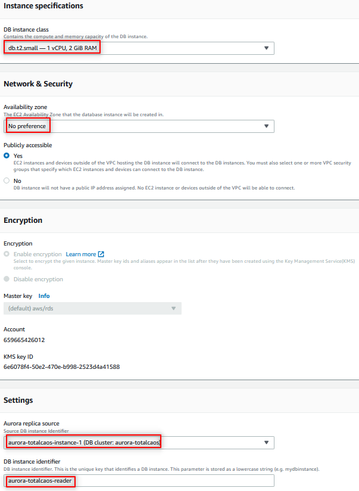

#### **Reading Data from Aurora Read Replica**

Once the read replica becomes available, click on the instance **aurora-{Your Name}-reader**, Go to the **Connectivity & security** tab, and copy the read replica **Endpoint**.

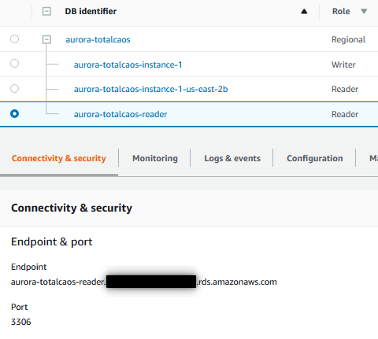

Connect read replica from your computer.  Make sure to replace the value below with your read replica endpoint

MacOS / Linux

```bash
mysql –h <reader endpoint name> -u <db user name> -p
```

Windows - Navigate to the MySQL Workbench folder (e.g. "C:\Program Files\MySQL\MySQL Workbench 6.2 CE")
```cmd
./mysql.exe -h <reader endpoint name> -u <db user name> -p
```
Use the read replica endpoint to run following SELECT query

```bash
mysql> use landsat;
Database changed
mysql>
mysql> select count(*) from scene_list;
+----------+
| count(*) |
+----------+
|       10 |
+----------+
1 row in set (0.25 sec)
```

Note that the read replica and primary database have the same records

## **Cloning Aurora Database**

Create a clone copy of your aurora database by performing the following steps:

In the RDS Aurora console, select your DB instance aurora-{Your Name}

Choose **Actions**, **Create clone**

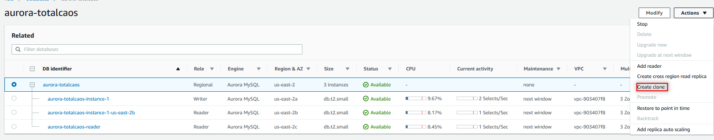

Use the following parameters to configure the cloned instance:

* DB Engine: Aurora
* DB Instance class: db.t2.small
* DB Instance identifier: aurora-{Your Name}-clone
* Publicly accessible: Yes

Leave all other fields to their default values.

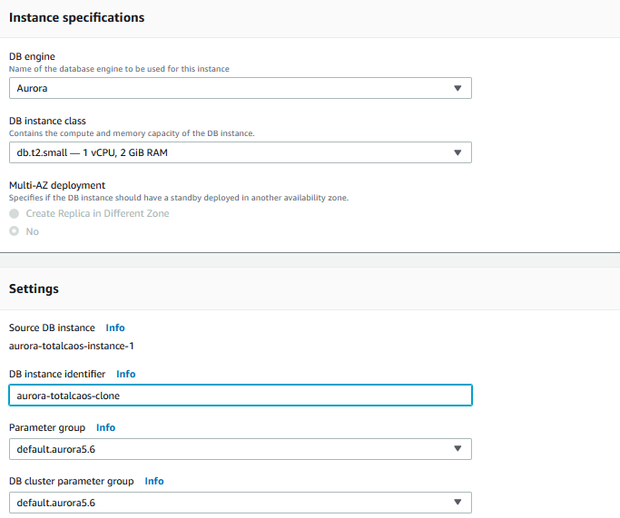

Click **Create Clone**

It may take a few minutes for the clone to become available.  After the clone is available, the Aurora Cluster will show:

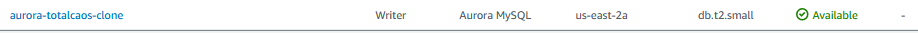

### **Compare Primary and Cloned database**

In this section, we will delete records from the primary database and validate that the delete operation does not affect the cloned database.


Perform the following tasks on your Primary Database.

Connect to primary endpoint:

MacOS / Linux

```bash
mysql –h <primary endpoint name> -u <db user name> -p
```

Windows - Navigate to the MySQL Workbench folder (e.g. "C:\Program Files\MySQL\MySQL Workbench 6.2 CE")
```cmd
./mysql.exe -h <primary endpoint name> -u <db user name> -p
```

Get the existing record count

```bash
mysql> use landsat;
Database changed
mysql>
mysql> select count(*) from scene_list;
+----------+
| count(*) |
+----------+
|       10 |
+----------+
1 row in set (0.25 sec)
```
Run DELETE query on primary DB instance to delete 5 records

```bash
mysql> delete from scene_list limit 5;
Query OK, 5 rows affected (0.25 sec)
```

Get the updated count:

```bash
mysql> select count(*) from scene_list;
+----------+
| count(*) |
+----------+
|        5 |
+----------+
1 row in set (0.25 sec)
```

Exit from your primary endpoint

```bash
mysql> exit
Bye
```

Perform the following tasks on your **Cloned** Database.

Connect to cloned endpoint

MacOS / Linux

```bash
mysql –h <cloned endpoint name> -u <db user name> -p
```

Windows - Navigate to the MySQL Workbench folder (e.g. "C:\Program Files\MySQL\MySQL Workbench 6.2 CE")
```cmd
./mysql.exe -h <cloned endpoint name> -u <db user name> -p
```

Get the existing record count

```bash
mysql> use landsat;
Database changed
mysql>
mysql> select count(*) from scene_list;
+----------+
| count(*) |
+----------+
|       10 |
+----------+
1 row in set (0.25 sec)
```
Exit from the cloned endpoint

```bash
mysql> exit
Bye
```

Notice that the cloned records match the primary count prior to deletion

## **Creating database snapshots**

Amazon RDS creates a storage volume snapshot of your DB cluster, backing up the entire DB cluster and not just individual databases. When you create a DB cluster snapshot, you need to identify which DB cluster you are going to back up, and then give your DB cluster snapshot a name so you can restore from it later. The amount of time it takes to create a DB cluster snapshot varies with the size your databases. Since the snapshot includes the entire storage volume, the size of files, such as temporary files, also affects the amount of time it takes to create the snapshot

**To create a DB cluster snapshot**

In the **[RDS Aurora Console](https://ap-southeast-2.console.aws.amazon.com/rds/home)** select the primary instance for the DB cluster aurora-{Your Name}

Choose Actions then Take Snapshot

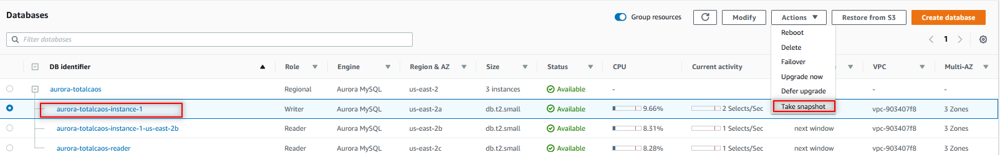

In the Take DB Snapshot window, provide a name for the snapshot: **aurora-{Your Name}-Snap1** and click **Take Snapshot**

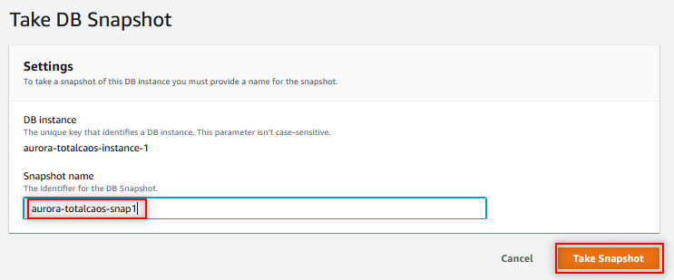

In the navigation pane, Click Snapshots, Select aurora-{Your Name}-Snap1 Once the status of your snapshot becomes available, Click **Actions**

Choose the drop down to see all the options available

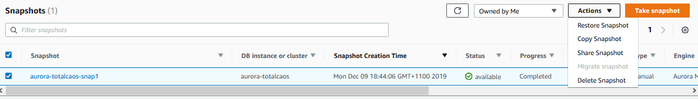

You can restore, copy, share or delete a snapshot. You can copy a snapshot between regions, and you can share a snapshot across accounts.

## **RDS Event Notifications**

Amazon RDS uses the Amazon Simple Notification Service (Amazon SNS) to provide notification when an Amazon RDS event occurs. These notifications can be in any notification form supported by Amazon SNS for an AWS region, such as an email, a text message, or a call to an HTTP endpoint.

To subscribe to RDS event notification:

In the **[RDS Aurora Console](https://ap-southeast-2.console.aws.amazon.com/rds/home)**  choose **Event Subscriptions**

In the Event subscriptions pane, choose Create event subscription

In the Create event subscription dialog box, do the following:

* Type aurora-{yourname}-failover-event for the Name of subscription
* For Send notifications to, choose New email topic
* Topic Name: aurora-{yourname}-email-topic
* For with these recipients, type {your email address}.  Make sure you can have access to your desired email address.
* For the Source type, select DB Clusters
* Select specific db clusters
* Choose aurora-{yourname}
* Event Category, choose Select specific db event categories
* Choose failover


Choose Create.

Once the subscription is active, go to your email inbox and confirm the event

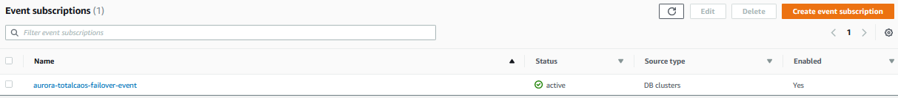

You have now created an event subscription that will get triggered when you failover your aurora cluster.

## **Aurora Failover**

Amazon Aurora failovers your primary instance to your standby instance.  If a standby instance is not created the primary instance failovers to an amazon aurora read replica. Amazon Aurora read replicas are associated with a priority tier (0-15).  In the event of a failover, Amazon RDS will promote the read replica that has the highest priority (the lowest numbered tier). If two or more replicas have the same priority, RDS will promote the one that is the same size as the previous primary instance.

**To failover your Amazon Aurora instance**

In the **[RDS Aurora Console](https://ap-southeast-2.console.aws.amazon.com/rds/home)** select the primary (writer) node aurora-{yourname}-instance-1.

Under **Actions** select **Failover**


Confirm the action in the Failover DB Cluster screen:


In the navigation pane, choose Events

Notice that the Database cluster failed over to your standby node

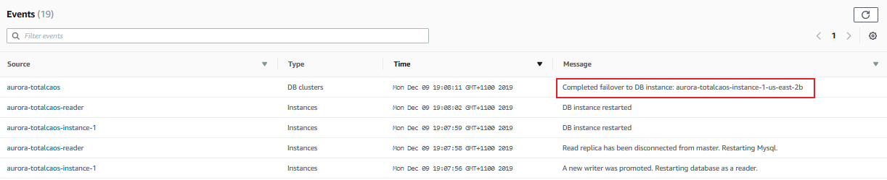

## **Clean UP**

Remember to clean up your lab environments by deleting

* All database instances
* Database snapshots
* Removing the event subscription
* Deleting the event Notificaiton topic

<br>

<br>

## **Resources & Links:**

### **Windows OS - Install MySQL Workbench**

Install the MySQL Workbench client from here

* https://dev.mysql.com/downloads/workbench/

### **MacOS - Install MySQL Client**

```bash
brew install mysql-client

echo 'export PATH="/usr/local/opt/mysql-client/bin:$PATH"' >> ~/.bash_profile

source ~/.bash_profile
```

<br/>

**[Labs Home](../README.md)**