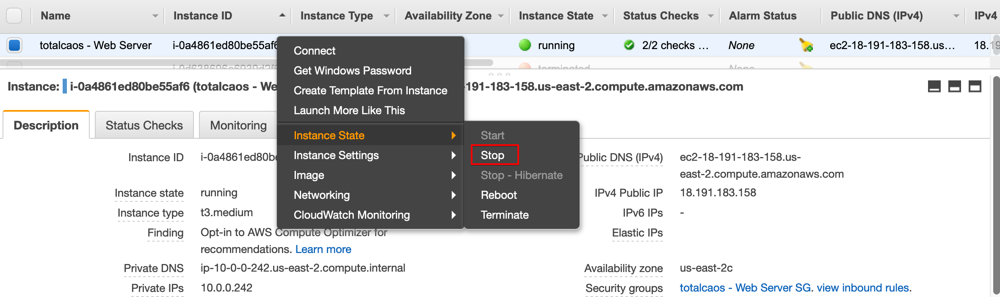
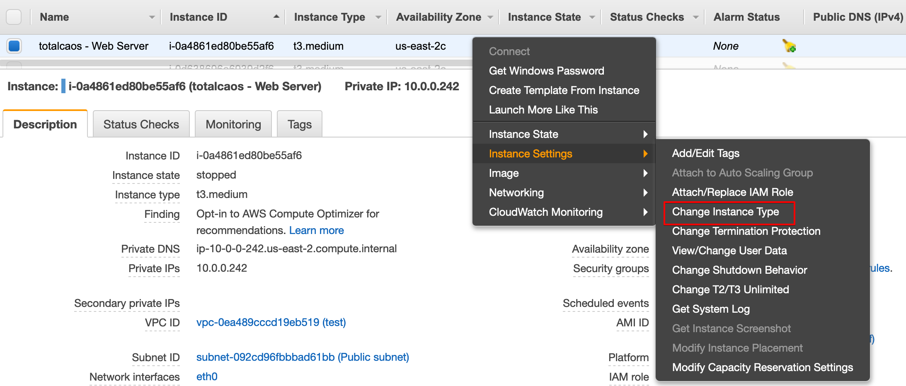
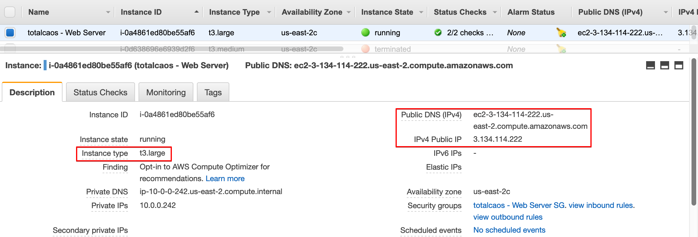

[Home](../README.md)<br>
[Module Home](README.md)

# **EC2 Hands On Lab (contd.)**
## **Changing the Instance Type**


Did you know that you can change the instance type that an AMI is running on? This is very useful when you need a larger (or smaller) or perhaps different type of instance to run a workload. This only works with EBS-backed instances (what we’re running here).  There is no particular reason to change the instance type in this lab, but the following steps outline how easy it is to do in AWS

In the AWS Console, select your lab instance, then right-click on it and hover over **Instance State** and select **Stop** (NOT Terminate).  Then select **Yes, Stop** to confirm.



After it has stopped, right-click on it again, hover over **Instance Settings** and select **Change Instance Type**



After going through the options and selecting **t3.large** as the instance type, right-click your lab instance and select **Start**



**_What happens to the public IP address after you start the instance again?_**

<br>
<Details>
<Summary><b>Optional (Challenge) - Deploy an EC2 Instance Using CloudFormation</b></Summary>
<br>
The challenge here is to deploy an EC2 instance into the VPC we created earlier using code rather than through the console.  In order to do this you will:
<br>

* Create a t3.medium Windows EC2 Instance
* Tag it with the name "[Your Name] Web Server"
* Deploy it into the Public Subnet of the VPC we created earlier in this module
* Assign the Security Group _(“[Your Name] Web Server SG”)_ we created earlier to the EC2 Instance
* Allocate an ElasticIP address to the EC2 Instance
* Test if we can browse to the website on the EC2 Instance

Use this CloudFormation Template as a starting point:

```
AWSTemplateFormatVersion: 2010-09-09
Resources:
  Ec2Instance:
    Type: AWS::EC2::Instance
    Properties:
      ...
      ImageId: ami-01b9e78fb84ac8b2f
      UserData:
        'Fn::Base64':
          !Sub |
            <powershell>
            Import-Module ServerManager;
            Install-WindowsFeature Web-Server -IncludeManagementTools -IncludeAllSubFeature
            remove-item -recurse c:\inetpub\wwwroot\*
            (New-Object System.Net.WebClient).DownloadFile("https://immersionday-labs.s3.amazonaws.com/ec2-windows.zip", "c:\inetpub\wwwroot\ec2-windows.zip")

            $shell = new-object -com shell.application
            $zip = $shell.NameSpace("c:\inetpub\wwwroot\ec2-windows.zip")
            foreach($item in $zip.items())
            {
              $shell.Namespace("c:\inetpub\wwwroot\").copyhere($item)
            }
            Start-Process "iisreset.exe" -NoNewWindow -Wait

            Import-Module NetSecurity;
            Set-NetFirewallRule -DisplayName "File and Printer Sharing (Echo Request - ICMPv4-In)" -enabled True
            </powershell>
      ...
      ...
  EIpAddress:
    Type:
  EIpAssociation:
    Type:
    Properties:
      InstanceId:
      EIP:
  Outputs:
    InstanceId:
      Description: InstanceID of the new EC2 Instance.
      Value: !Ref 'Ec2Instance'
  InstanceIpAddress:
    Description: Public IP Address of the EC2 Instance.
    Value: !Ref 'EIpAddress'
```
<br>
<b>Resources & Documentation</b>

* [EC2 Instance CFN Documentation](https://docs.aws.amazon.com/AWSCloudFormation/latest/UserGuide/aws-properties-ec2-instance.html)
* [Elastic IP Address CFN Documentation](https://docs.aws.amazon.com/AWSCloudFormation/latest/UserGuide/aws-properties-ec2-eip.html)
* [Elastic IP Allocation CFN Documentation](https://docs.aws.amazon.com/AWSCloudFormation/latest/UserGuide/aws-properties-ec2-eip-association.html)
* [Resource Tags using CFN](https://docs.aws.amazon.com/AWSCloudFormation/latest/UserGuide/aws-properties-resource-tags.html)

</Details>
<br>
<Details>
<Summary><b>Optional - Deploy an <i><u>Amazon Linux</u></i> EC2 Instance</b></Summary>
<br>
Modify the CloudFormation Template you created above to deploy an Amazon Linux EC2 Instance.  Use the code below in the user data section to deploy a webserver on the instance.

```bash
#include
https://s3.amazonaws.com/immersionday-labs/bootstrap.sh
```

</Details>

### Additional resources & reading

* [EC2 User Data](http://docs.aws.amazon.com/AWSEC2/latest/WindowsGuide/ec2-instance-metadata.html)
* [Using Tags](http://docs.aws.amazon.com/AWSEC2/latest/UserGuide/Using_Tags.html)
