# **EC2 Hands On Lab**

Amazon Elastic Compute Cloud (Amazon EC2) is a web service that provides resizable compute capacity in the cloud. Amazon EC2’s simple web service interface allows you to obtain and configure capacity with minimal friction. Amazon EC2 reduces the time required to obtain and boot new server instances to minutes, allowing you to quickly scale capacity, both up and down, as your computing requirements change. Amazon EC2 changes the economics of computing by allowing you to pay only for capacity that you actually use.

This lab will walk you through launching, configuring, and customizing an EC2 web server (Windows and Linux) using the AWS Management Console

## **Getting Started with Windows Server on Amazon EC2**

### **Launch a Windows Web Server Instance**

In this example we will launch a Windows Server 2019 instance with the IIS web server installed upon boot.

1. Sign into the AWS Management Console and open the **Amazon EC2 console** https://console.aws.amazon.com/ec2.

2. Click on **Launch Instance**

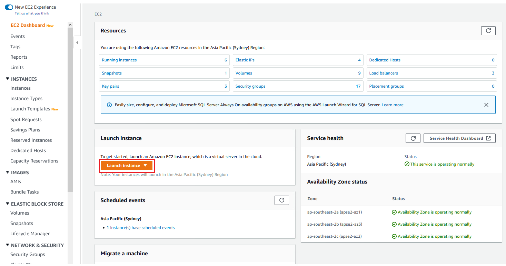

3. Scroll down and click Select on the Windows Server 2019 Base AMI

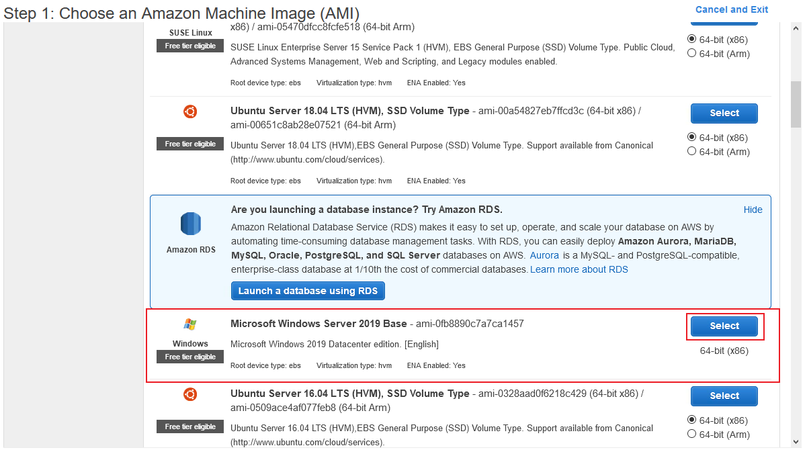

4. In the **Choose Instance Type** tab, select the **t3.medium** instance size and click **Next: Configure Instance Details**

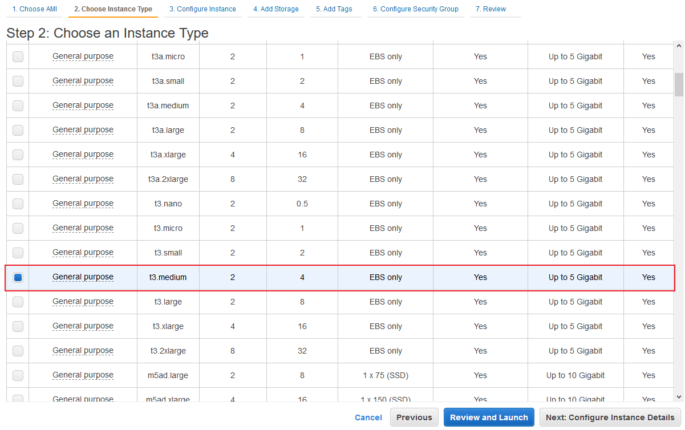

5. On the **Configure Instance Details** page, select the VPC you created in the [previous module](../vpclab/README.md), and the Public Subnet.  Ensure that the Auto-Assign Public IP is enabled.

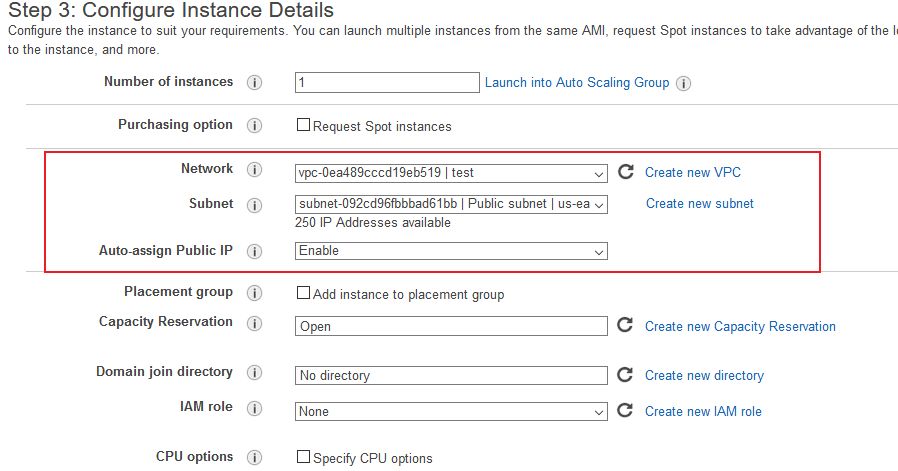

6. Now expand the **Advanced Details** section, copy/paste the script below into the User Data field (this PowerShell script will install/start IIS and deploy a simple web page) and click **Next: Add Storage**:

<Details>
<Summary>UserData Code</Summary>

```powershell
<powershell>
Import-Module ServerManager;
Install-WindowsFeature Web-Server -IncludeManagementTools -IncludeAllSubFeature
remove-item -recurse c:\inetpub\wwwroot\*
(New-Object System.Net.WebClient).DownloadFile("https://immersionday-labs.s3.amazonaws.com/ec2-windows.zip", "c:\inetpub\wwwroot\ec2-windows.zip")

$shell = new-object -com shell.application
$zip = $shell.NameSpace("c:\inetpub\wwwroot\ec2-windows.zip")
foreach($item in $zip.items())
{
	$shell.Namespace("c:\inetpub\wwwroot\").copyhere($item)
}
Start-Process "iisreset.exe" -NoNewWindow -Wait
</powershell>
```
</Details>
<br>

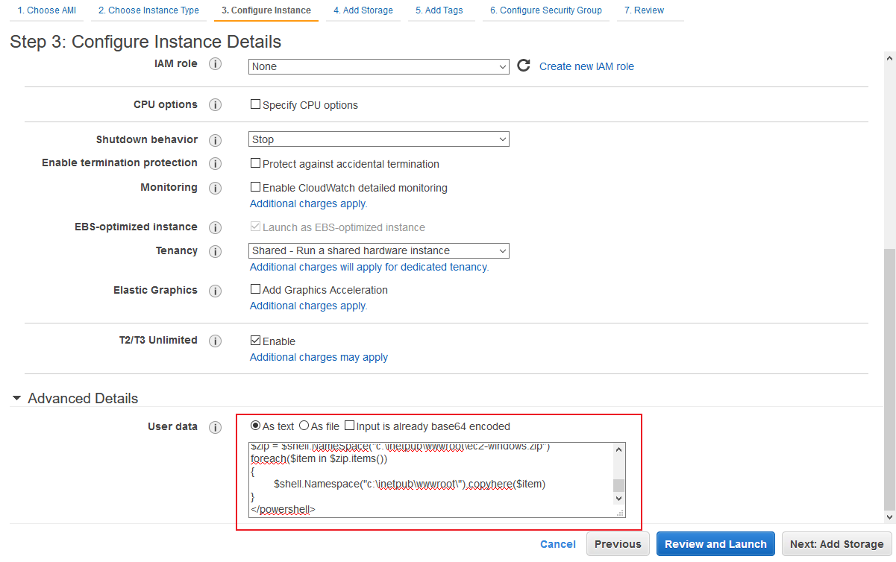

On the **Step 4: Add Storage** screen, **Click Next: Add Tags** to accept the default Storage Device Configuration and move to the Step 5: Add Tags screen.

Next, choose a “friendly name” for your instance. This name, more correctly known as a tag, will appear in the console once the instance launches. It makes it easy to keep track of running machines in a complex environment. Name yours according to this format: **_“[Your Name] Web Server”_**.

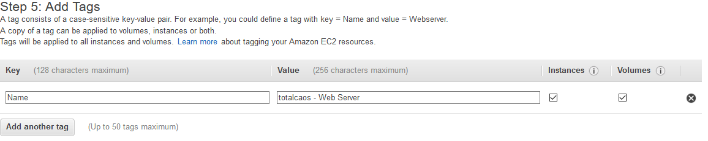

Then click Next: **Configure Security Group**.

7. You will be prompted to create a new security group, which will be your **firewall rules**. On the assumption that we are building out a Web server, name this security group according to this format **_“[Your Name] Web Server SG”_**, and open ports **3389** and **80**.
8. Click the **Review and Launch** button after configuring the security group.

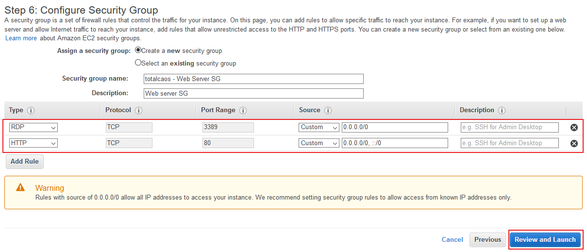

9. Review your choices, and then click **Launch**.

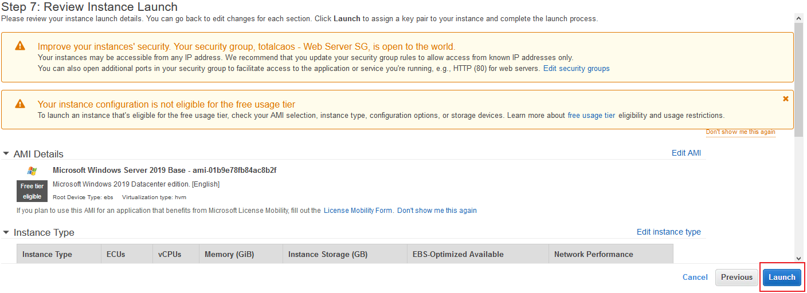

_Note the two warning boxes at the top of the page, these are to warn you about possible configuration issues. In this lab we are creating a Windows server that has RDP access that is “open to the world” this is something that you wouldn’t normally do._

10. Now you need to create a public/private keypair.  When this instance launches, you will connect to it via Remote Desktop using the credentials for “administrator”.  For Windows instances, EC2 automatically generates a password and encrypts with your public key.  To decrypt the encrypted password, you will use your private key.   Let’s create a new public/private keypair.

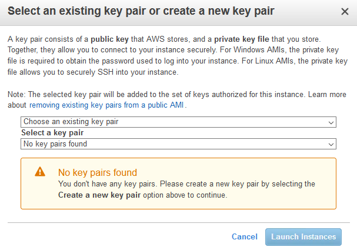

11. Enter a name for the key pair using the following format: [YourName]-KeyPair and click Download Key Pair.

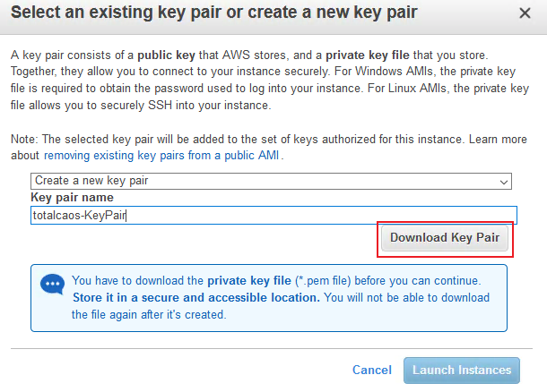

12.	Your browser will download the private portion of the key pair to your PC.  It will have a name like JohnDoe-KeyPair.pem.  Note the location of this file because you will need it later to decrypt the administrator password.
13.	Now click the **Launch Instances** button to launch your Windows web server.
14.	The next screen will confirm that your instance is now launching.  Click the **View Instances** button. Once your instance has launched, you will see the **_“[Your Name] Web Server”_** instance as well as the Availability Zone the instance is in and its publicly routable DNS name.

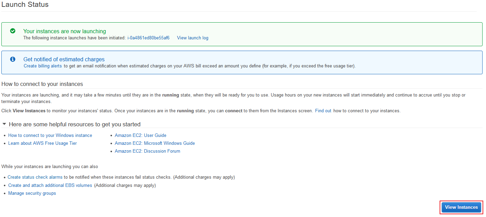

### **Browse the Web Server**

Now you will browse to the Web Server site that was installed on the Instance using the PowerShell script defined in the User Data section during creation of the instance. Wait for the instance to pass the Status Checks.  For Windows instances, this could take up to 10 minutes.

When complete, you will see the Status Checks have passed.

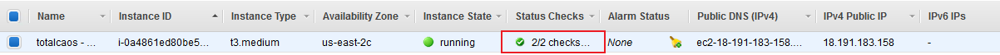

Open a new browser tab and browse the Web Server by entering the EC2 instance’s Public DNS name into the browser.  The EC2 instance’s Public DNS name can be found in the console by reviewing the “Public DNS” column. You should see a page that looks similar to this:

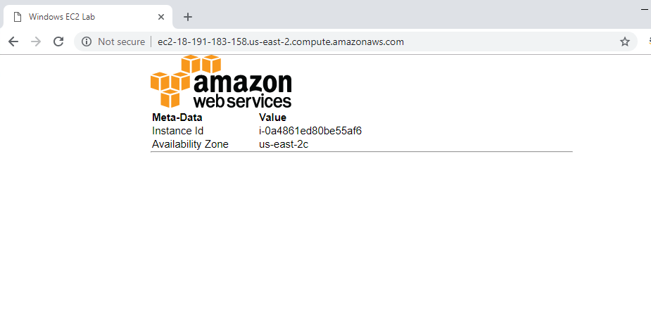

### **Test Access to your instance**