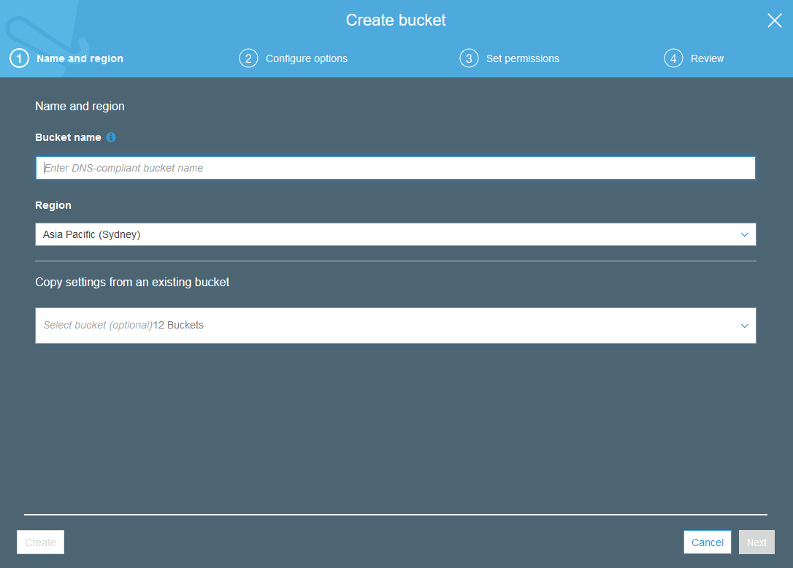
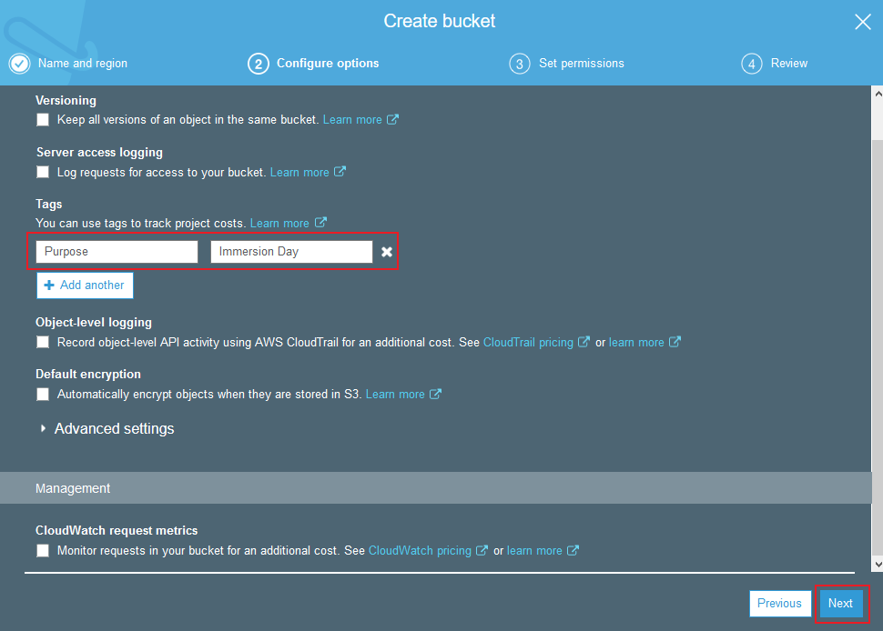
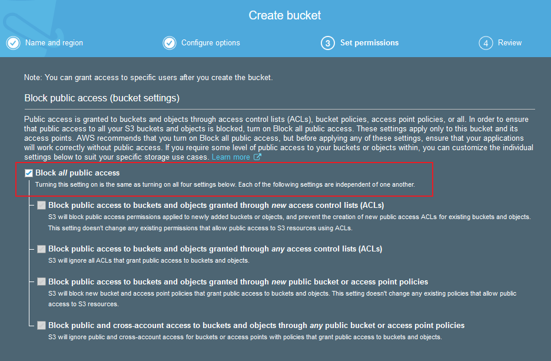
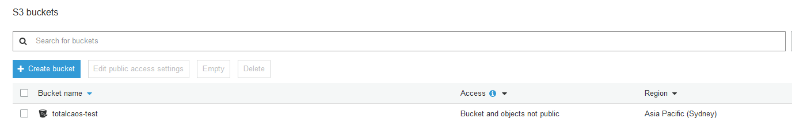
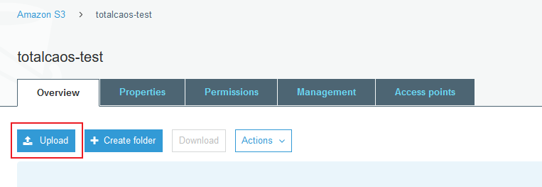
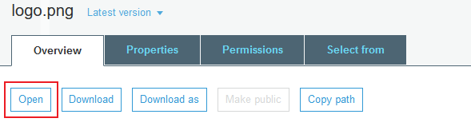
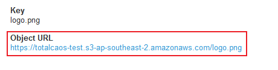

**[Labs Home](../README.md) | [Back ..](README.md)**

# **Storage on AWS Hands on Labs**

Amazon Simple Storage Service (S3) provides a simple web services interface that can be used to store and retrieve any amount of data, at any time, from anywhere on the web. This lab is designed to demonstrate how to interact with S3 to store, view, move and delete objects.

## **Create a Bucket in S3**

Every object in Amazon S3 is stored in a bucket. Before you can store data in Amazon S3 you must create a bucket.

_Note: You are not charged for creating a bucket; you are only charged for storing objects in the bucket and for transferring objects in and out of the bucket._

Sign into the AWS Management Console and open the **[Amazon S3 console](https://console.aws.amazon.com/s3)**

Click C**reate Bucket**. The **Create a Bucket** dialog box appears



Enter a bucket name in the Bucket Name field. The bucket name you choose must be unique across all existing bucket names in Amazon S3.  Prefix your bucket name with your name to create a unique name i.e. **_[yourname-bucketname]_**.

Bucket names must comply with the following requirements.
* Can contain lowercase letters, numbers, periods (.) and dashes (-)
* Must start with a number or letter
* Must be between 3 and 255 characters long
* Must not be formatted as an IP address (e.g., 265.255.5.4)

**Note:** There might be additional restrictions on bucket names based on the region your bucket is in or how you intend to access the object. Once you create a bucket, **you cannot change its name**. In addition, the bucket name is visible in the URL that points to the objects stored in the bucket. Make sure the bucket name you choose is appropriate.

In the Region drop-down list box, select **Asia Pacific (Sydney)** as the region and click **Next**

Under Tags, in the **Key** box, type **Purpose**, and in the **Value** box, enter **Immersion Day**.  Have a good look at the other options, but leave them as default for this lab. Click **Next**.



Note that by default S3 buckets now blocks all public access.



Finally, review your settings and click Create bucket.  When Amazon S3 successfully creates your bucket, the console displays your empty bucket in the Buckets panel



## **Add an Object to a Bucket**

Now that you've created a bucket, you're ready to add an object to it. An object can be any kind of file: a text file, a photo, a video and so forth. When you add a file to Amazon S3, you have the option of including metadata with the file and setting permissions to control access to the file.

In the **[Amazon S3 console](https://console.aws.amazon.com/s3)**, click the on the name of the bucket to which you want to upload an object (not the bucket icon itself, though), and then click **Upload** in the **Overview** tab. The Upload dialogue opens (its appearance may differ slightly between different browsers).



Click Add Files to select a file to upload. A file selection dialog box opens.
Select a small file to upload and click Open. The Upload dialogue shows the files and folders you've selected to upload.

Click Upload. You can watch the progress of the upload at the bottom of the screen. This appears as soon as the upload begins.

## **View an Object**

Now that you've added an object to a bucket, you can try and open and view it in a browser.

In the Amazon S3 console, click the on the name of the object you want to open, and in the next window click the **Open** button to view the file.



What happens when you click on the Object Url?



_**Note**: By default, your Amazon S3 buckets and objects are private. To view an object using a URL, for example, `https://s3.amazonaws.com/Bucket/Object` the object must be publicly readable. Otherwise, you will need to create signed URL that includes a signature with authentication information. You can optionally save the object locally._

<Details>
<Summary><b>Optional (Challenge Task) - Create an S3 bucket with default server-side bucket encryption enabled using CloudFormation</b></summary>

```yaml
AWSTemplateFormatVersion: 2010-09-09
Description: S3 bucket with default encryption
Resources:
  MyEncrpytedS3Bucket:
    Type:
    Properties:
      BucketName: !Sub 'encryptedbucket-${AWS::Region}-${AWS::AccountId}'
        ...
        ...
    DeletionPolicy: Delete

```
<b>Resources & Links</b>

* [S3 Bucket CloudFormation Documentation](https://docs.aws.amazon.com/AWSCloudFormation/latest/UserGuide/aws-properties-s3-bucket.html)

<br>
</Details>
<br>
<Details>
<Summary><b>Optional (Challenge Task) - Create a S3 bucket with default servers side bucket encryption using the AWS CLI</b></Summary>

You will need to:

* Create the bucket using **create-bucket**
* Enable Server-side encryption using **put-bucket-encryption**

<b>Resources & Links</b>

* [AWS CLI Reference](https://docs.aws.amazon.com/cli/latest/reference/s3api/index.html)


</Details>
<br>

**[Labs Home](../README.md) | [Back ..](README.md)**
